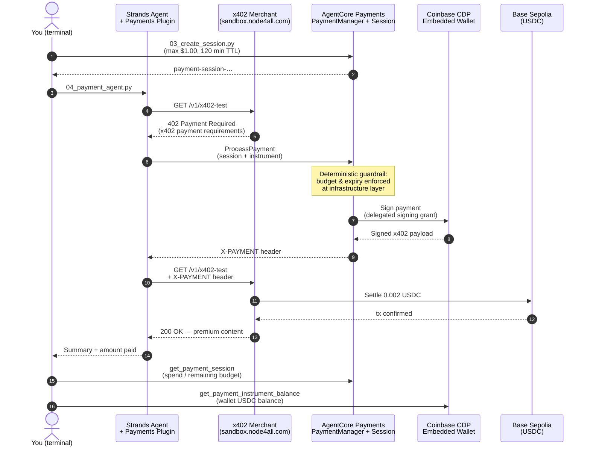

# AgentCore Payments — On-Stage Flow & Commands

AWS Summit, September 2 · account `<ACCOUNT_ID>` · region `us-east-1` · profile `<aws-profile>`

## Transition into the demo (after the MCP/A2A part)

The protocol ladder — frame the demo as the logical climax of the session:

> **MCP = tools · A2A = collaboration · x402 = commerce.**
> Three open protocols, one autonomy story.

Spoken transition (use almost verbatim):

> "So we've given our agents tools with MCP, and colleagues with A2A. But
> there's a third thing agents need that we've quietly ignored: **money**.
> Every tool we've called so far was free. The moment an agent hits a premium
> API, it stops and waits for a human with a credit card. What if the agent
> could just… *pay*? That sounds terrifying — an LLM with a wallet — which is
> exactly why this demo matters. The budget isn't a prompt instruction; it's
> enforced **deterministically by AWS infrastructure**. Let me show you a
> Strands agent — the same framework you just saw — buying content on its
> own, with a hard $1 limit it *cannot* exceed."

Framing device: **lead with the fear, not the feature.** Name the risk upfront
("an LLM with a wallet — terrifying, right?"), then answer it with the
deterministic session budget — which the optional overspend demo (step 4
below) proves live.

## End-to-end flow



Key talking point: the agent contains **zero payment code**. The plugin intercepts the 402; the budget is enforced **deterministically by AgentCore**, not by the LLM.

## Commands (in order)

### 0. One-time terminal setup

```bash
cd /path/to/AWS-Summit-Zurich-2026   # wherever you cloned this repo
python3 -m venv .venv                # once, if not created yet
source .venv/bin/activate
pip install -r requirements.txt     # once
cd demo
```

### 1. Fresh budget-limited session — "$1 max, 2 hours, infrastructure-enforced"

```bash
python 03_create_session.py 1.00 120
```

### 2. The money shot — agent pays for content autonomously

```bash
python 04_payment_agent.py
```

Watch for: `402` intercepted → payment signed → content arrives →
session budget / remaining budget / wallet balance printed at the end.

### 3. (Optional) Custom prompt variant

```bash
python 04_payment_agent.py "Buy me the premium data at https://sandbox.node4all.com/v1/x402-test"
```

### 4. (Optional) Prove the guardrail — exhaust a tiny budget

```bash
python 03_create_session.py 0.003 30   # budget only covers one ~0.002 USDC payment
python 04_payment_agent.py             # 1st run: pays fine
python 04_payment_agent.py             # 2nd run: session REJECTS the payment
```

Talking point: "The agent *cannot* overspend — that's the trust story."

## If something goes wrong

| Symptom | Fix |
|---|---|
| Session expired / not found | `python 03_create_session.py 1.00 120` |
| "Delegated signing grant is not active" | https://hub.cdp.coinbase.com/<your-hub-id> (<your-email>, email OTP) |
| "No balance found … USDC" | https://faucet.circle.com → Base Sepolia → `0xE5eA49eae5Ce81235763Eb1FaB306C8F6580B2ab` |
| Merchant down | Any x402 endpoint works — x402 Bazaar via AgentCore Gateway |
| Wi-Fi / model issues | Play the pre-recorded terminal run |

## Reference values

- Wallet: `0xE5eA49eae5Ce81235763Eb1FaB306C8F6580B2ab` (~20 USDC on Base Sepolia)
- Payment manager: `summitdemopayments-vn3fq6o8xk` · connector: `summitdemocoinbaseconnector-x8bhgjblsx`
- Instrument: `payment-instrument-XXXXXXXXXXXX` · user: `summit-demo-user`
- Typical payment: **0.002 USDC** per request
